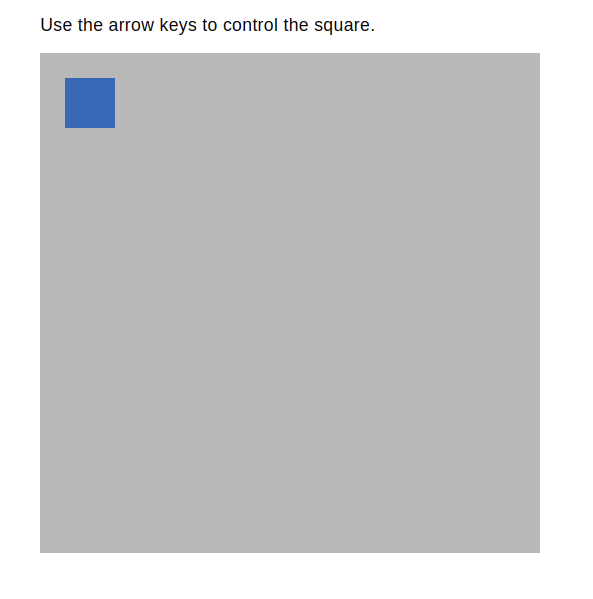

  
  
  

<h1 align="center">Move Square</h1>

<a href="https://move-square.netlify.app/"><h3 align="center">Try me!</h3></a>

  
## Technologies Used

&nbsp;&nbsp;&nbsp;&nbsp;&nbsp;&nbsp;

&nbsp;&nbsp;&nbsp;&nbsp;&nbsp;&nbsp;

&nbsp;&nbsp;&nbsp;&nbsp;&nbsp;&nbsp;

&nbsp;&nbsp;&nbsp;&nbsp;&nbsp;&nbsp;

  
## Description

A simple SVG example featuring a movable square. An SVG image is regenerated using JavaScript, when a keyboard arrow is pressed.

## Screenshot

## License

Copyright (c) 2022 Michael Kolesidis 
Licensed under the [GNU General Public License v3.0](https://github.com/michaelkolesidis/webproject-script/blob/main/LICENSE).

[//]: # (Free Software)

   
   

  

                                                       

  

